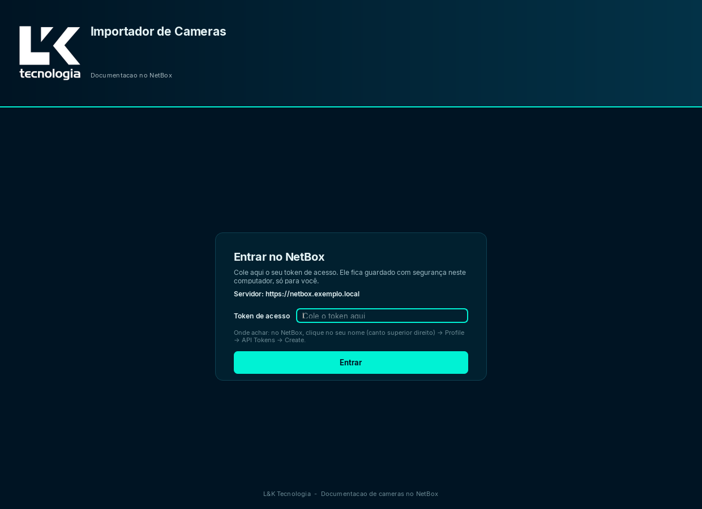
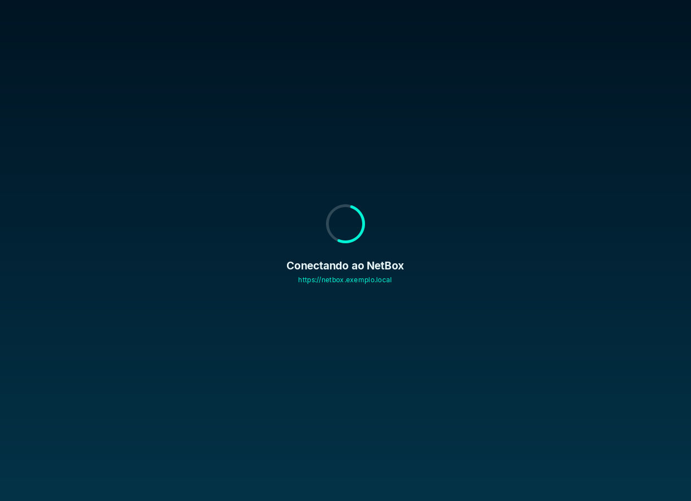
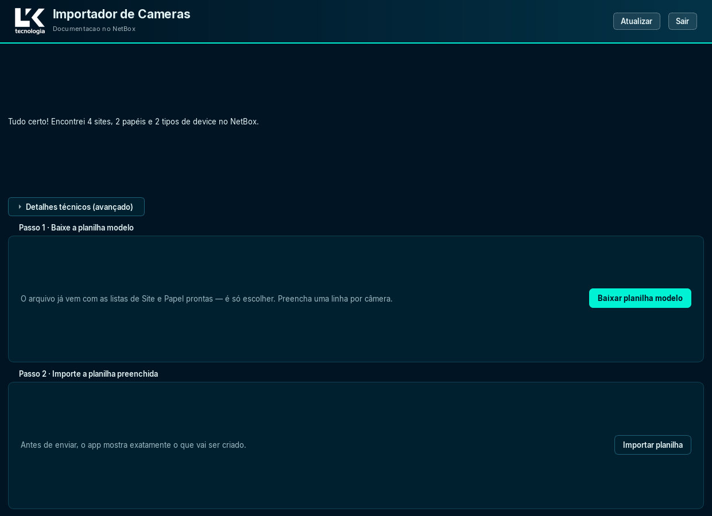
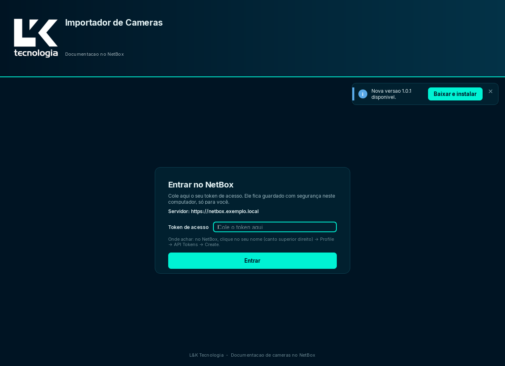

# Importador de Câmeras para NetBox

[](https://github.com/lucasdaniel2201/netbox-device-importer/actions/workflows/tests.yml)
[](LICENSE)
[]()
[]()

Registra em lote o parque de câmeras e switches no NetBox a partir de uma planilha, com prévia do que será criado antes de enviar qualquer coisa — e roda como aplicativo Windows instalável, sem precisar de Python.

App desktop em Python + PySide6 (Qt6) que documenta câmeras e switches no **NetBox v4.3.6** usando a **API REST** (`/api/...`). Não há scraping: tudo é JSON sobre HTTP com um token de API.

O app é pensado para usuário leigo: login por token, geração de planilha modelo com listas suspensas do próprio NetBox, prévia do que será criado antes de enviar qualquer coisa e relatórios da execução.

**Sumário**

- [Para quem vai usar](#para-quem-vai-usar)
- [Para quem vai mexer no código](#para-quem-vai-mexer-no-código)
- [Como usar](#como-usar)
- [Regras da importação](#regras-da-importação)
- [Relatórios](#relatórios)
- [Verificação de atualizações](#verificação-de-atualizações)
- [Arquitetura](#arquitetura)
- [Testes](#testes)
- [Build do executável](#build-do-executável)
- [Instalador e portátil](#instalador-e-portátil)
- [Ao lançar uma nova versão](#ao-lançar-uma-nova-versão)
- [Onde o app grava arquivos](#onde-o-app-grava-arquivos)
- [Limitações conhecidas](#limitações-conhecidas)
- [Status](#status)
- [Estrutura do projeto](#estrutura-do-projeto)
- [Controle de versão](#controle-de-versão)
- [Licença](#licença)

## Para quem vai usar

Baixe o `ImportadorCamerasSetup-<versão>.exe` mais recente na página de **Releases** do repositório e execute. A instalação é **por usuário** (não pede administrador), cria atalho no Menu Iniciar e tem desinstalador.

Requisitos: Windows 10/11 x64. Não precisa de Python instalado.

A mesma Release traz o **executável portátil** (`ImportadorCameras.exe`), para o caso de não dar para instalar. A escolha entre os dois está em *Instalador e portátil*, mais abaixo.

## Para quem vai mexer no código

```powershell
pip install -r requirements.txt
python -m app.main
```

Sem console — e sem ver traceback nem os logs `[netbox]`:

```powershell
pythonw run_app.py
```

Dependências: `openpyxl`, `requests`, `PySide6` (`requirements.txt`).

Para o lint (o CI roda exatamente este comando):

```powershell
pip install -r requirements-dev.txt
python -m ruff check .
```

Observação sobre certificado: quando o NetBox é acessado por IP interno com certificado autoassinado, a primeira tentativa de conexão falha e o app repete a conexão aceitando o certificado. Essa decisão fica registrada no schema do ambiente (não é escondida).

## Como usar

O app tem três telas: **login por token**, **carregando** (conexão e descoberta do ambiente) e **ambiente NetBox**.

| Login por token | Conectando e descobrindo | Ambiente NetBox |
| --- | --- | --- |
|  |  |  |

### Login

- A URL do servidor é fixa no código (`app/config.py`). Só o **token de API** é informado na tela.
- O token fica guardado **cifrado pelo DPAPI do Windows** (`app/credentials.py`), amarrado à conta e à máquina do usuário. Copiar o arquivo para outra máquina não funciona. Nenhuma senha fica em disco.
- Com token guardado, o login é pulado e o app vai direto ao carregamento. O botão "Esquecer token guardado" apaga o token local.
- As permissões de API são as do dono do token; o app mostra quem é esse usuário no cabeçalho.
- Onde achar o token: no NetBox, clique no seu nome (canto superior direito) → Profile → API Tokens → Create.

### Ambiente NetBox

Ao conectar, o app descobre o ambiente: sites, papéis (roles), tipos de device, fabricantes, contagens gerais, custom fields e o que o token pode fazer em cada endpoint. A tela resume o que existe ("Encontrei N sites, N papéis e N tipos de device") e tem um painel "Detalhes técnicos (avançado)" com a árvore completa e a opção de salvar o schema em JSON. No cabeçalho ficam "Atualizar" (relê o ambiente) e "Sair" (encerra a sessão).

- **Passo 1 · Baixar planilha modelo**: gera o `modelo_cameras_netbox.xlsx` com as listas de Site e Papel preenchidas a partir do NetBox.
- **Passo 2 · Importar planilha**: abre o diálogo de importação com a planilha preenchida.

### A planilha modelo

Colunas: Nome do host, Site, Papel (role), IP, Fabricante, Modelo, Firmware, Endereço MAC, Servidor (NVR), Descrição.

- **Nome do host**: obrigatório, até 64 caracteres (limite do campo no NetBox), sem duplicados.
- **Site**: obrigatório; sai como lista suspensa alimentada pela aba de apoio "Listas".
- **Papel**: opcional; em branco vale o papel padrão do app (`Camera`, em `app/import_plan.py`). Câmeras e switches podem ir no mesmo arquivo, com o papel por linha.
- **IP**: opcional; um device pode ficar documentado sem endereço (caso do switch sem IP).
- **Fabricante + Modelo**: compõem o device-type; se a combinação não existir no NetBox, o app oferece criar.
- **Firmware** e **Servidor (NVR)**: vão para o campo `comments` do device.
- **Endereço MAC** e **Descrição**: interface principal e descrição do device.

Aceita `.xlsx` (com listas suspensas) ou `.csv` (sem listas; o app avisa para conferir Site e Papel à mão).

### Diálogo de importação

1. Escolha a planilha. O app valida linha a linha e monta o **plano**: cada linha aparece como "pronto", "com erro" ou "pendente: criar \<referência\>".
2. Referências ausentes (fabricante, device-type) só são criadas com confirmação explícita, no botão "Criar o que está faltando".
3. Enquanto houver linha com erro, referência pendente ou campo obrigatório do NetBox sem valor, o botão de importar fica **bloqueado**.
4. Durante a execução há barra de progresso por device e botão de cancelar.
5. Ao final, um resumo mostra criados, atualizados, sem mudança, erros e avisos, amostras dos erros e o caminho do relatório.

## Regras da importação

**Idempotência.** Para cada objeto o app faz `GET` e decide: não existe → `POST` (criar); existe e está igual → nada (conta como "exists"); existe e difere → `PATCH` (atualizar). Vale para device, interface, IP e referências. Rodar a mesma planilha de novo não duplica nada.

**Custom fields obrigatórios.** O NetBox desta instância exige `Validavel` (device, booleano) e `add_to_zabbix` (IP address, select). Como a API não expõe as opções dos campos `select`, o valor de `add_to_zabbix` vem de amostragem de um IP existente. O que estiver declarado em `CUSTOM_FIELDS` (`app/config.py`) vence. Campo obrigatório sem valor bloqueia a importação com aviso antes do envio; o que for de fato enviado aparece no resumo do plano e no relatório.

**Rede em passos independentes.** A ordem é interface → IP → `primary_ip4` (no NetBox o IP só se vincula ao device por uma interface). Cada passo é independente de propósito: falha em um vira **aviso**, não erro — o device permanece gravado. O IP é opcional; sem IP, `primary_ip4` não é definido. A descrição do IP é o nome do device.

**Status.** Todo device é gravado com status `active`; o status não vem da planilha.

## Relatórios

Cada importação grava três arquivos em `reports/` (`app/reports.py`):

| Arquivo | Conteúdo |
| --- | --- |
| `netbox-import-<data-hora>.log` | Uma linha por device. |
| `netbox-import-<data-hora>.json` | Resumo da execução + resultado por linha, com o `X-Request-ID` de cada escrita (dá para auditar depois em `/api/extras/object-changes/`). |
| `netbox-import-<data-hora>.csv` | Resultado por linha, em planilha. |

## Verificação de atualizações

Ao abrir, o app consulta a **última Release publicada** deste repositório numa thread própria — a tela de login continua respondendo enquanto a consulta acontece. Se a versão da Release for **mais nova** que a do app, aparece um aviso no canto com o número da versão e o botão **Baixar e instalar**. Se for a mesma (ou mais antiga), nada aparece.



O botão baixa o instalador em streaming (são ~57 MB, nunca inteiros na memória), mostra o progresso no próprio botão e, ao terminar, abre o `Setup.exe` — o Inno Setup faz o upgrade por cima. Como essa é a única parte do app que baixa **e executa** um binário, a URL passa por validação antes de qualquer byte sair: só HTTPS, e só hosts do GitHub (`github.com`, `api.github.com` e subdomínios de `githubusercontent.com`, que é para onde o download de um asset redireciona). A Release que não tiver instalador anexado produz um aviso sem botão, apenas com o link.

A comparação quebra a versão em números (`1.10.0` → `(1, 10, 0)`) em vez de comparar o texto. Comparar texto diria que `"1.10.0"` é **menor** que `"1.9.0"` — e o aviso de atualização nunca apareceria justamente na passagem da 1.9 para a 1.10.

Quatro decisões que valem ser conhecidas:

- **Falha na checagem automática é silenciosa.** Sem internet é o caso normal do analista em campo, não um erro para ele ver. Quando a consulta não funciona, simplesmente não acontece nada: nenhum aviso de erro, nenhum log na cara do usuário.
- **Falha de uma ação sua não é.** Se o usuário clicou em baixar e algo deu errado, o erro aparece com a causa. O silêncio vale só para a consulta que acontece sozinha.
- **O app não se substitui.** Ele baixa e abre o instalador; quem instala é o Inno Setup, com o usuário na frente. O app trocar o próprio `.exe` em execução exigiria um processo auxiliar (o Windows trava o arquivo em uso) e ficou **fora do escopo** de propósito.
- **O repositório precisa ser público** para a consulta funcionar sem autenticação: em repositório privado, essa rota responde `404` para quem não está autenticado. Embutir um token no `.exe` foi descartado — quem tem o executável extrai o token.

## Arquitetura

O princípio é simples: **a interface pede, o worker executa.** Nenhuma tela fala com a rede.

```
main_window.py  (UI — thread principal)
     |  emite sinais do Qt
     v
session.py — SessionWorker  (QObject em QThread propria)
     |
     v
netbox_client.py — NetBoxClient  --HTTP/JSON-->  NetBox (/api/...)

update_check.py — UpdateCheckWorker  (thread propria, independente)
     |
     v
GitHub Releases API
```

- `app/main_window.py` nunca chama a rede: emite sinais do Qt e reage a sinais de volta. É o que mantém a janela respondendo enquanto a conexão acontece.
- `app/session.py` tem o `SessionWorker`, um `QObject` movido para uma `QThread` com `moveToThread`. Conexão, descoberta, provisionamento de referências e importação rodam todos nessa thread, e o Qt entrega os resultados por conexão enfileirada — a UI não toca em widget a partir de outra thread.
- `app/netbox_client.py` é o cliente REST: paginação, rate limit, esquema de token (`Token`/`Bearer`) e mensagens de erro legíveis.
- `app/import_plan.py` é puro de propósito: transforma a planilha validada em payload sem tocar na rede, o que o torna testável offline.
- `app/provision.py` descobre o ambiente e faz os upserts; `app/reports.py` grava log, JSON e CSV no fim da importação.
- A verificação de atualizações usa uma **segunda thread** (`app/update_check.py`), independente da sessão do NetBox, disparada no boot.

## Testes

```powershell
python -m unittest discover -s tests
```

Usam apenas a stdlib (`unittest`) e rodam **sem rede**. Cobrem a leitura e validação da planilha, o plano de importação, o cliente HTTP, o provisionamento, a sessão, a checagem de atualizações, o download do instalador, credenciais, caminhos e partes da interface (toast, spinner, janela). Hoje são 345 testes. Rode antes de alterar a importação, a planilha ou a checagem de atualizações.

O CI roda essa suíte a cada push, em **Windows** (é obrigatório: o app usa a DPAPI do Windows) nas versões 3.12 e 3.14 do Python, e o Ruff separadamente em Linux. O estado está no badge no topo.

## Build do executável

```powershell
pip install pyinstaller
python -m PyInstaller --clean --noconfirm ImportadorCameras.spec
```

Gera `dist\ImportadorCameras.exe`: arquivo único, sem console, com ícone da marca e metadados de `version_info.txt` (nome, versão, "L&K Tecnologia"). Os assets (logo `lk_white.png`, ícone `app_icon.png/.ico` e a fonte Inter) vão embutidos e são resolvidos por `app/paths.py`.

Atenção ao editar o `.spec`: não exclua da stdlib módulos que as dependências usam. `email` (usado por `requests`/`urllib3`) e `xml` (usado por `openpyxl`) já quebraram o executável quando foram excluídos.

## Instalador e portátil

A Release publica dois binários. **Use o instalador, salvo se não puder.**

| Binário | Quando usar |
| --- | --- |
| `ImportadorCamerasSetup-<versão>.exe` (instalador) | **Padrão.** Instala por usuário em `%LOCALAPPDATA%\Programs\Importador de Cameras`, sem pedir administrador; cria atalho no Menu Iniciar e, opcionalmente, na Área de Trabalho; instala o desinstalador e é atualizável por cima. |
| `ImportadorCameras.exe` (portátil) | Quando não der para rodar instalador (política da máquina) ou quando o app precisar rodar de pendrive / pasta de rede. Não cria atalho nem desinstalador: o arquivo roda de onde estiver. |

Nos dois casos os relatórios vão para uma pasta `reports\` gravável ao lado do executável; se essa pasta for somente leitura, o app passa a usar `%LOCALAPPDATA%\ImportadorNetBox`.

Para **gerar** os dois, requer o [Inno Setup 6](https://jrsoftware.org/isdl.php) — o executável vem do PyInstaller, acima:

```powershell
& "C:\Program Files (x86)\Inno Setup 6\ISCC.exe" instalador.iss
```

O `instalador.iss` empacota o `dist\ImportadorCameras.exe` já gerado, por isso o PyInstaller roda primeiro.

## Ao lançar uma nova versão

1. Atualize `__version__` em `app/version.py` — é a versão que o app compara com a Release.
2. Atualize `AppVersion` no `instalador.iss`.
3. Atualize a versão no `version_info.txt`.
4. Registre a versão no `CHANGELOG.md`.
5. Gere o executável e o instalador.
6. Publique a Release no GitHub com os dois binários: é dela que o app lê a versão mais nova.

São três arquivos com a mesma versão porque cada um é lido por quem é diferente: o Python (`app/version.py`), o Inno Setup (`instalador.iss`) e o Windows (`version_info.txt`). Se você esquecer um deles, o `tests/test_version.py` falha e diz qual ficou para trás — é a trava contra o erro de lançamento mais provável.

**Nunca mude o `AppId`** do instalador: é ele que permite atualizar por cima e desinstalar corretamente.

O que não versionar: `build/` e `dist/` (artefatos). O `ImportadorCameras.spec` e o `instalador.iss` **são** versionados — são a configuração do build.

## Onde o app grava arquivos

| Conteúdo | Local |
| --- | --- |
| Relatórios (`reports/`) e `app_error.log` | Código-fonte: raiz do projeto. `.exe`: ao lado do executável; se a pasta não for gravável, `%LOCALAPPDATA%\ImportadorNetBox`. |
| Token guardado (`token.dat`, cifrado) | `%LOCALAPPDATA%\ImportadorNetBox`, sempre — nunca ao lado do `.exe`. |

Resolvido por `app/paths.py`.

## Limitações conhecidas

- **MAC em interface de template**: quando o device-type já cria a interface do device por template, atualizar o MAC pode falhar com um erro de validação do NetBox (`poe_type` sem `poe_mode`). É limitação do NetBox, não do app: o passo vira aviso no relatório e não impede a criação do IP.

## Status

- **Pronto:** login por token cifrado, descoberta do ambiente, planilha modelo com listas suspensas, plano de importação com prévia, importação idempotente (device, interface, IP e `primary_ip4`), relatórios em log/JSON/CSV, instalador Inno Setup e portátil, e a verificação de atualizações — que avisa, baixa o instalador e o abre.
- **Fora do escopo, por decisão de projeto:** o app **não** instala sozinho, sem ninguém na frente, e não substitui o próprio `.exe` em execução. Isso exigiria um processo auxiliar, porque o Windows trava o arquivo em uso.
- **Plataforma:** Windows 10/11 x64. Não roda em Linux ou macOS: usa a DPAPI do Windows para cifrar o token da API.

## Estrutura do projeto

| Caminho | Função |
| --- | --- |
| `run_app.py` | Ponto de entrada do executável (usado pelo PyInstaller) e do `pythonw run_app.py`. |
| `requirements.txt` | Dependências Python, com versão fixada (`openpyxl`, `requests`, `PySide6`). |
| `requirements-dev.txt` | Dependência de desenvolvimento (`ruff`). |
| `pyproject.toml` | Configuração do Ruff (lint). |
| `ImportadorCameras.spec` | Configuração do build do PyInstaller. |
| `instalador.iss` | Configuração do instalador (Inno Setup 6). |
| `version_info.txt` | Metadados do `.exe` (nome, versão, empresa). |
| `LICENSE` | Licença do projeto (MIT). |
| `CHANGELOG.md` | Histórico de mudanças por versão. |
| `README.md` | Este arquivo. |
| `app/` | Código do aplicativo (módulos abaixo). |
| `app/assets/` | Identidade visual: logo `lk_white.png`, ícone `app_icon.png/.ico` e fonte Inter (`assets/fonts/`). |
| `tests/` | Testes automatizados (`unittest`), rodam sem rede. |
| `tools/screenshots.py` | Utilitário de desenvolvimento que gera as telas deste README sem abrir janela. |
| `docs/screenshots/` | As imagens usadas neste README. |
| `reports/` | Relatórios gerados a cada importação (não versionado). |

Módulos de `app/`:

| Módulo | Função |
| --- | --- |
| `app/main.py` | Ponto de entrada: QApplication, fonte Inter, tema escuro e janela principal; falhas sem console vão para `app_error.log`. |
| `app/main_window.py` | Janela com as três telas (login, carregando, ambiente); gera o modelo e abre a importação. |
| `app/session.py` | `SessionWorker`: thread única que detém a sessão HTTP; conecta, descobre o ambiente, provisiona referências, executa a importação e grava os relatórios. |
| `app/netbox_client.py` | Cliente REST: paginação, rate limit, esquema de token `Token`/`Bearer` e mensagens de erro legíveis. |
| `app/provision.py` | Descoberta do ambiente (snapshot), criação de referências e upserts de device, interface, IP e `primary_ip4`. |
| `app/import_plan.py` | Plano de importação: planilha validada → payload por device; resolve referências e custom fields. Não fala com a rede (testável offline). |
| `app/spreadsheet.py` | Leitura e validação de `.xlsx`/`.csv` e geração do modelo com listas suspensas de Site e Papel. |
| `app/import_dialog.py` | Diálogo de importação: plano, provisionamento de referências, progresso e resultado. |
| `app/reports.py` | Grava log, JSON e CSV em `reports/`. |
| `app/credentials.py` | Guarda o token cifrado com o DPAPI do Windows (`token.dat`). |
| `app/config.py` | Configuração fixa do deployment: URL do NetBox e `CUSTOM_FIELDS`. |
| `app/paths.py` | Caminhos no código-fonte e no `.exe` (assets embutidos, pastas graváveis). |
| `app/theme.py` | Paleta e estilo do tema escuro na identidade do NetBox. |
| `app/loading.py` | Spinner da tela de carregamento (desenhado com QPainter). |
| `app/toast.py` | Notificações não invasivas no canto superior direito. |
| `app/version.py` | Versão do aplicativo em Python (`__version__`), usada na checagem de atualizações. |
| `app/updater.py` | Comparação de versões (`parse_version`, `ha_atualizacao`) e leitura da última Release no GitHub. Não fala com a interface (testável offline). |
| `app/update_check.py` | `UpdateCheckWorker`: roda a checagem em thread própria e avisa por sinal. Falha silenciosa sem internet. |
| `app/update_download.py` | `UpdateDownloadWorker`: baixa o instalador em streaming, com progresso, e o abre. Valida que a URL é HTTPS e de um host do GitHub antes de baixar. |

## Controle de versão

O projeto está sob git. O `.gitignore` exclui `reports/`, `app_error.log`, `__pycache__/`, `.commandcode/`, `build/`, `dist/`, planilhas de teste (`teste_importacao_*.xlsx`) e os logos locais de clientes. Nenhuma credencial é versionada: o token fica cifrado na pasta de dados do usuário.

## Licença

MIT — veja [LICENSE](LICENSE).
